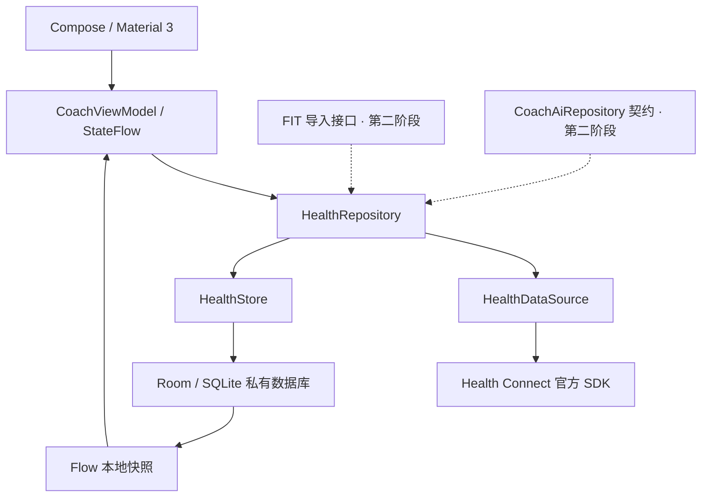

# 架构

采用单 app 模块，按职责分包，方便 V0.1 构建和后续拆分。手动依赖注入，无服务器、后台任务或真实 AI 实现。

## 目录

| 路径 | 职责 |
| --- | --- |
| `domain/Models.kt` | 无 Android 依赖的类型、时间窗口、稳定记录键、去重 |
| `domain/Contracts.kt` | HealthDataSource / Store / Repository 及 FIT、AI 契约 |
| `data/healthconnect/HealthConnectSource.kt` | 可用性、读取权限映射、分页读取、官方聚合、标准化 |
| `data/local/CoachDatabase.kt` | Room entities、DAO、事务、模型转换 |
| `data/DefaultHealthRepository.kt` | 权限检查、串行刷新、逐类型错误隔离、撤销清理 |
| `ui/` | StateFlow ViewModel、纯状态 Compose 界面、黑白主题、隐私说明 |
| `MainActivity.kt` | Activity Result 授权合约、前台生命周期、系统设置入口 |
| `PermissionsRationaleActivity.kt` | Android 13 及 14+ 官方隐私说明入口 |

## 本地模型

- `health_records`：唯一 key、类型、来源包名、HC record ID、开始/结束、来源 lastModified、标准单位 value、JSON payload。心率全部 samples、睡眠 stages、时区偏移和元数据保存在 payload。
- `daily_values`：复合主键 `(metric, date)`；可空 value、聚合贡献来源、统计时区和读取时间。值单位为步 / bpm / 米 / 秒。
- `sync_status`：每类型状态、尝试时间、最后成功时间、用户可读错误原因。进程中断后的 SYNCING 在再次检查时转换为可重试 ERROR。
- Room v1 schema 导出到 `app/schemas/`。升级时新增显式 Migration 和迁移测试，不允许自动破坏性重建。

## 刷新与一致性

1. Repository 的 Mutex 串行化权限检查、刷新和清除，避免并行刷新与清除的竞争。
2. 检查可用性和当前实际权限，清除已撤销类型。读取当前时区的最近 7 个日历日。
3. 各授权类型逐一读取全部原始分页（1,000 条/页）与每天的 Aggregate。每页和每个聚合前检查该类型权限；若系统拒绝访问则立即停止。
4. 所有读取完成后再次检查权限，并在 Room 事务中替换该类型的原始记录、聚合、成功状态。
5. 失败不提交半份快照。安全异常或已确认撤销会清除该类型；普通读取异常保留旧缓存并标记错误。CancellationException 始终传播。
6. Room 监听三张表的失效通知，每次在同一个读取事务中获得原始记录、日统计和同步状态，避免分别观察后合并出新旧混合快照。
7. UI 只在权限已验证且类型获授权时显示健康值；来自数据库的历史快照也受此门控。权限检查无法完成时不会凭旧授权状态显示数据。
8. ViewModel 串行处理刷新和前台检查；授权结果早于前台回调时先排队，清除结束后也执行待处理检查。进入后台使权限校验代次失效，较早的回调不能重新显示健康值。

Health Connect 本身没有跨多个原始读取与聚合调用的快照隔离保证：上游在刷新中修改记录时，来源列表与聚合可能短暂不一致，下一次刷新重新读取。V0.1 不通过 Changes token 维护无限历史，避免 token 失效和窗口外历史权限需求。

## 扩展

- **FIT**：通过 Storage Access Framework 用户主动选择文件，单独实现 FitImportRepository。来源命名空间使用 `fit:`，文件 SHA-256 与消息索引去重，保留明确的导入来源，不伪装成 Health Connect 的记录。
- **DeepSeek**：实现 CoachAiRepository 的预览与批准契约；网络适配器独立于 HealthRepository。V0.1 无任何该接口的实例或调用路径。
- 后续可将 domain / data / UI 拆模块，引入 Room Migration、来源选择和按起床日显示的睡眠视图。任何新权限都必须重新说明并按需申请。
